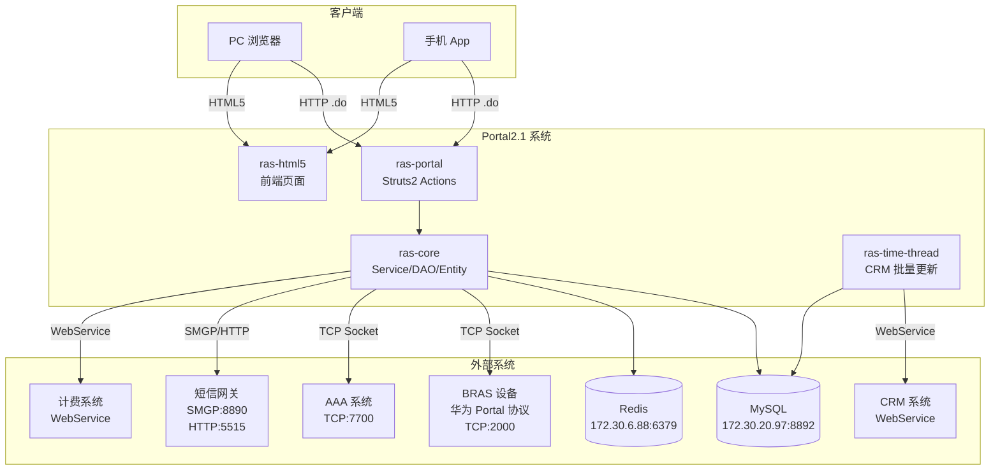

# 项目整体认知报告

## 0. 分析快照

- **目标仓库/目录：** `C:\WorkSpace\JavaProject\xykd-yfy\xykd-java-yfcloud2025\Portal2.1`
- **分析时间：** 2026-06-13
- **分支 / Commit / 子模块状态：** 无法确认（仓库内未发现 `.git/HEAD` 可直接读取的分支信息，`.git` 目录存在但未通过 Git 命令行确认当前分支与提交号）
- **技术生态线索：**
  - Maven 多模块项目（`ras-parent` → `ras-portal` / `ras-core` / `ras-time-thread`）
  - Spring 3.2.5 + Struts2 2.5.26 + Hibernate 3.3.2
  - Proxool 连接池 + MySQL 8.0.28 + Redis (Jedis 2.4.1)
  - 前端 HTML5 静态页面（`ras-html5`）
  - Quartz 定时任务
  - 自定义华为 Portal 协议实现（TCP Socket）
  - SMGP 短信网关协议
- **可见配置与依赖范围：**
  - 包含代码仓库、配置文件（`jdbc.properties`、`para.properties`、`applicationContext.xml`、`struts.xml`）
  - 包含生产环境数据库地址（`172.30.20.97:8892`）、Redis 地址（`172.30.6.88:6379`）、AAA 系统地址（`135.148.118.86:7700`）、短信网关地址（`135.151.0.101:8890`）
  - 包含 AES 加密数据库凭据
  - 缺失私有 Nexus 仓库（`10.18.100.72:8081` 已注释）
  - 存在 `system` scope 依赖（`sqljdbc4.jar`、`ismp-utils-1.0.jar`）
- **本次分析限制：**
  - 缺少运行环境，无法验证运行时行为
  - 缺少数据库实例，无法确认实际表结构与索引
  - 私有 Maven 仓库不可访问，部分依赖可能无法解析
  - `lib/` 目录下的 JAR 包未逐一检查
  - 前端 `ras-html5` 模块仅做了目录级扫描，未深入分析 JS 逻辑
  - 无法确认生产环境部署拓扑（是否集群、负载均衡策略等）

---

## 1. 一句话概述

`[合理推断]` 本项目是中国电信甘肃万维公司开发的**校园网 WiFi Portal 认证系统**，负责处理校园网用户的上网认证（密码认证、短信验证码认证、免密认证）、下线管理、在线检测、短信发送、VPN 代理、防代理检测、上网时间控制等核心业务，通过华为 Portal 协议与 BRAS 设备交互，通过 TCP 协议与 AAA 系统交互完成用户鉴权与计费。

---

## 2. 系统形态与技术栈

### 2.1 系统形态

`[已确认事实]` 本系统是一个**单体 Web 应用**，采用 Spring + Struts2 + Hibernate 经典 SSH 架构，打包为 WAR 部署到 Servlet 容器（如 Tomcat）。同时存在一个独立的定时任务模块（`ras-time-thread`），用于 CRM 用户信息批量更新。

`[合理推断]` 系统以 HTTP API 方式对外提供服务，客户端为 HTML5 页面（PC/手机端），通过 AJAX 调用后端 `.do` 接口。

### 2.2 语言、框架与构建工具

| 类别 | 技术 | 版本 | 证据 |
|------|------|------|------|
| 语言 | Java | 未明确指定（基于依赖推断 JDK 6-8） | `ras-parent/pom.xml` |
| Web 框架 | Struts2 | 2.5.26 | `ras-parent/pom.xml` |
| IoC 容器 | Spring Framework | 3.2.5.RELEASE | `ras-parent/pom.xml` |
| ORM | Hibernate | 3.3.2.GA | `ras-parent/pom.xml` |
| 数据库 | MySQL | 8.0.28 | `ras-parent/pom.xml`、`jdbc.properties` |
| 连接池 | Proxool | 未指定版本 | `applicationContext.xml` |
| 缓存 | Redis (Jedis) | 2.4.1 / spring-data-redis 1.2.0 | `ras-portal/pom.xml` |
| 二级缓存 | EhCache | 随 Hibernate 版本 | `applicationContext.xml` |
| 定时任务 | Quartz | 1.6.3 | `ras-portal/pom.xml` |
| JSON | Fastjson | 1.2.76 | `ras-portal/pom.xml` |
| 日志 | Log4j 1.x | 1.2.17 | `ras-portal/pom.xml`、`log4j.properties` |
| 构建工具 | Maven | - | `ras-parent/pom.xml` |
| 短信协议 | SMGP（自定义实现） | - | `com.gsww.smgp` 包 |
| Portal 协议 | 华为 Portal 协议（自定义 TCP 实现） | - | `com.gsww.ras.service.HwImpl` 包 |
| 加密 | DES3 / AES | - | `DES3.java`、`AesEncryptUtil.java` |

### 2.3 工程组织方式

`[已确认事实]` Maven 多模块项目，模块结构如下：

```
ras-parent (POM 聚合)
├── ras-portal    (WAR) — 主 Web 应用，包含 Action、Filter、配置
├── ras-core      (JAR) — 核心业务逻辑，包含 Entity、DAO、Service、Auth 实现
├── ras-time-thread (JAR) — 定时任务模块，CRM 用户信息批量更新
└── ras-html5     (静态资源) — HTML5 前端页面
```

**关键观察：**
- `ras-portal` 依赖 `ras-core`（`pom.xml` 中 `com.gsww:ras-core:1.0`）
- `ras-portal` 的源码目录非标准 Maven 布局：`src/java/main` 而非 `src/main/java`
- `ras-portal` 的资源目录：`src/java/resource`，输出到 `WebRoot/WEB-INF/classes`
- `ras-core` 的源码目录同样非标准：`src/java/main`
- `ras-time-thread` 有独立的 `main()` 入口，可独立运行

### 2.4 多服务与多入口

`[已确认事实]` 系统存在以下独立进程/入口：

1. **主 Web 应用**（`ras-portal` WAR）— 部署到 Servlet 容器
2. **定时任务进程**（`ras-time-thread`）— 独立 JVM 进程，通过 `main()` 启动
3. **Quartz 定时任务**（内嵌于 `ras-portal`）— 每天 4:00 执行 `checkNet()`

---

## 3. 核心数据模型与 Schema/DDL

### 3.1 核心实体与表映射

`[已确认事实]` 以下为代码中可确认的核心实体及其表映射（基于 JPA 注解）：

| 实体类 | 表名 | 业务角色 | 证据 |
|--------|------|----------|------|
| `WebSession` | `tb_web_session` | **核心会话表**，记录用户上网会话全生命周期 | `WebSession.java` @Table |
| `SysAccount` | 未确认 | 系统账号 | `SysAccount.java` |
| `AuthCode` | 未确认 | 短信验证码记录 | `AuthCode.java` |
| `CurrentOnlineList` | 未确认 | 当前在线用户列表 | `CurrentOnlineList.java` |
| `BrasIp` | 未确认 | BRAS 设备 IP 与类型映射 | `BrasIp.java` |
| `CrmUserinfo` | 未确认 | CRM 用户信息（从外部系统同步） | `CrmUserinfo.java` |
| `OnlineCtrl` | 未确认 | 上网时间控制规则 | `OnlineCtrl.java` |
| `AntiProxyInfo` | 未确认 | 防代理检测信息 | `AntiProxyInfo.java` |
| `SecurityProtocolRecord` | 未确认 | 安全协议记录 | `SecurityProtocolRecord.java` |
| `NetHeartCheck` | 未确认 | 网络心跳检测 | `NetHeartCheck.java` |
| `AaaInterfaceLog` | 未确认 | AAA 接口调用日志 | `AaaInterfaceLog.java` |
| `SmsReadySend` / `SmsReadySendDetail` | 未确认 | 短信待发送队列 | `SmsReadySend.java` |
| `AccountMobileInfo` | 未确认 | 账号手机绑定信息 | `AccountMobileInfo.java` |
| `UserOperationLog` | 未确认 | 用户操作日志 | `UserOperationLog.java` |
| `Sendrecord` | 未确认 | 短信发送记录 | `Sendrecord.java` |
| `Holiday` | 未确认 | 节假日配置 | `Holiday.java` |
| `NotifyMessage` | 未确认 | 通知消息 | `NotifyMessage.java` |
| `FalutReport` / `FaultReportingInfo` | 未确认 | 故障报告 | `FalutReport.java` |
| `FastcardLoginLog` | 未确认 | 快卡登录日志 | `FastcardLoginLog.java` |
| `PrUserPorxyRecords` | 未确认 | 用户代理记录 | `PrUserPorxyRecords.java` |
| `PrUserPorxyAreaheatConfig` | 未确认 | 代理区域热力配置 | `PrUserPorxyAreaheatConfig.java` |
| `PrUserPorxyHeartConfig` | 未确认 | 代理心跳配置 | `PrUserPorxyHeartConfig.java` |
| `PrUserPorxyOnlineusers` | 未确认 | 代理在线用户 | `PrUserPorxyOnlineusers.java` |
| `PrUserPorxyUserdisheart` | 未确认 | 代理用户心跳异常 | `PrUserPorxyUserdisheart.java` |
| `UserAppversionRecord` | 未确认 | 用户 App 版本记录 | `UserAppversionRecord.java` |
| `NetAccBindTelInfo` | 未确认 | 网络账号绑定电话信息 | `NetAccBindTelInfo.java` |
| `SysParameter` / `SysPara` / `SysParaType` | 未确认 | 系统参数配置 | `SysParameter.java` |
| `SysDepartment` | 未确认 | 系统部门 | `SysDepartment.java` |
| `UpdateInfo` | 未确认 | 更新信息 | `UpdateInfo.java` |
| `AppsInfo` | 未确认 | 应用信息 | `AppsInfo.java` |
| `CustOrder` / `OrderRequest` / `OrderResponse` | 未确认 | 订单相关 | `CustOrder.java` |

### 3.2 核心会话模型 `WebSession` 详解

`[已确认事实]` `WebSession` 是系统最核心的数据模型，承载用户上网会话的完整生命周期：

```
WebSession (tb_web_session)
├── sessionId (SESSION_KEY, PK, uuid.hex, 32位)
├── createTime (CREATE_TIME)     — 会话创建时间
├── authTime (AUTH_TIME)         — 认证成功时间
├── authConfirmTime (AUTH_CONFIRM_TIME) — 认证确认时间
├── serialNo (SERIAL_NO)         — Portal 协议序列号
├── reqId (REQ_ID)               — Portal 协议请求ID
├── userName                     — 用户名（含 @edu 后缀）
├── userIp                       — 用户客户端IP
├── proxyIp                      — NAT444 代理IP
├── userPort                     — 用户端口
├── logoutTime                   — 下线时间
├── onlineTime                   — 上线时间
├── ntfLogoutTime                — 通知下线时间
├── basName                      — BRAS 设备名称
├── totalTime                    — 上网总时长
└── fouceLogoutReason            — 强制下线原因
```

### 3.3 数据模型分析缺口

`[待确认问题]` 以下信息无法仅从代码确认：
- 实际数据库 DDL（建表语句、索引、约束）— 仓库内未发现 SQL 迁移脚本
- 表之间的外键关系
- 索引策略（代码中 `WebSessionServiceImp` 提到按 `userName+userIp+proxyIp` 三参数查询优化，暗示存在复合索引）
- 数据量级与分区策略
- `columnDefinition = "String"` 在 Hibernate 3 中可能映射为 `VARCHAR(255)`，但实际 DDL 可能不同

---

## 4. 关键入口与启动方式

### 4.1 Web/API 入口

`[已确认事实]` 所有 HTTP 入口通过 Struts2 Action 映射，URL 后缀为 `.do`。

**核心认证入口：**

| URL 模式 | Action 类 | 方法 | 业务含义 | 证据 |
|----------|-----------|------|----------|------|
| `/authWithOutPwd.do` | `PortalAuthAction` | `authWithOutPwd()` | 免密码上网认证（手机IMEI绑定） | `struts/portalAuth.xml` |
| `/webQuit.do` | `PortalAuthAction` | `quit()` | 用户主动下线 | `struts/portalAuth.xml` |
| `/kickTerminal.do` | `PortalAuthAction` | `kickTerminal()` | 踢指定终端下线 | `struts/portalAuth.xml` |
| `/userAuthNew.do` | `PortalAuthWithStaticAction` | `userAuthNew()` | 验证码认证自动登录 | `struts/portalAuthWithStatic.xml` |
| `/webCertification.do` | `PortalAuthWithStaticAction` | `webCertification()` | Web 认证接口 | `struts/portalAuthWithStatic.xml` |
| `/getOnlineTerminals.do` | `PortalAuthWithStaticAction` | `getOnlineTerminals()` | 在线终端查询 | `struts/portalAuthWithStatic.xml` |
| `/getOnlineTerminalsBySession.do` | `PortalAuthWithStaticAction` | `getOnlineTerminalsBySession()` | 基于 session 的在线终端查询 | `struts/portalAuthWithStatic.xml` |
| `/getJudgeSession.do` | `PortalAuthWithStaticAction` | `getJudgeSession1()` | 判断 Session 是否存在 | `struts/portalAuthWithStatic.xml` |
| `/VerificationCode.do` | `PortalAuthWithStaticAction` | `serviceCaptcha()` | 验证码图片 | `struts/portalAuthWithStatic.xml` |
| `/getSmSPcWeb.do` | `SmsWithStaticPwdAction` | `getSmsPwdAndStaticPwdPcMobWeb()` | Web 端短信验证 | `struts/smsWithStaticPwd.xml` |
| `/getSmSPcMob.do` | `SmsWithStaticPwdAction` | `getSmsPwdAndStaticPwdPcMob()` | 手机端短信验证 | `struts/smsWithStaticPwd.xml` |

**其他业务入口（18+ Struts 配置文件）：**

| 配置文件 | 业务域 | 证据 |
|----------|--------|------|
| `vpnAuth.xml` | VPN 认证 | `struts/` 目录 |
| `antiProxy.xml` | 防代理检测 | `struts/` 目录 |
| `prAntiProxy.xml` | 代理检测（另一套） | `struts/` 目录 |
| `wifiTime.xml` | WiFi 时间控制 | `struts/` 目录 |
| `schoolNet.xml` | 校园网管理 | `struts/` 目录 |
| `securityProtocol.xml` | 安全协议 | `struts/` 目录 |
| `message.xml` | 消息管理 | `struts/` 目录 |
| `notifyMessage.xml` | 通知消息 | `struts/` 目录 |
| `clientInfo.xml` | 客户端信息 | `struts/` 目录 |
| `userInfo.xml` | 用户信息 | `struts/` 目录 |
| `smsInfo.xml` | 短信信息 | `struts/` 目录 |
| `pwdChange.xml` | 密码修改 | `struts/` 目录 |
| `fastcardLoginLog.xml` | 快卡登录日志 | `struts/` 目录 |
| `dueTime.xml` | 到期时间 | `struts/` 目录 |
| `wifiUserQuery.xml` | WiFi 用户查询 | `struts/` 目录 |
| `falutReport.xml` | 故障报告 | `struts/` 目录 |
| `checkToken.xml` | Token 校验 | `struts/` 目录 |

### 4.2 定时任务入口

`[已确认事实]`

1. **Quartz 定时任务（内嵌于 ras-portal）：**
   - 任务：`checkNet()` — 每天凌晨 4:00 执行
   - 功能：检测用户网络上网情况，清理已下线用户的心跳记录
   - 证据：`applicationContext.xml` 中 `CronTriggerBean` 配置 `0 0 4 * * ?`

2. **独立定时任务进程（ras-time-thread）：**
   - 入口：`UpdateCrmUserinfoTimeAction.main()`
   - 功能：批量更新 CRM 用户信息，使用 20 线程并发处理
   - 证据：`UpdateCrmUserinfoTimeAction.java`

### 4.3 鉴权与中间件链路

`[已确认事实]` HTTP 请求经过以下过滤器链：

```
请求 → encodingFilter (UTF-8 编码, *.do/*.jsp)
     → hibernateOpenSessionInViewFilter (Open Session In View, *.do)
     → StrutsPrepareFilter (Struts2 准备, /*)
     → StrutsExecuteFilter (Struts2 执行, /*)
     → ActionSafeFilter (XSS 防护, *.action/*.do)
     → Struts2 Interceptor Stack (crudStack)
         → store (ActionMessage 保持)
         → paramsPrepareParamsStack (参数处理)
         → fileUpload (文件上传)
         → privilege (自定义权限拦截器 ActionAInterceptor)
     → Action 方法
```

**关键观察：**
- `ActionSafeFilter` 仅检查 QueryString 中的特殊字符（`u0023`、`u0024`、`u005E`、`u002A`、`\`、`%`），**不检查 POST Body**，防护范围有限
- `ActionAInterceptor` 为自定义权限拦截器，但具体逻辑未深入分析
- `SessionListener` 为自定义 HttpSession 监听器
- 无全局鉴权拦截器（如 Spring Security），认证逻辑分散在各 Action 方法中

---

## 5. 目录结构与模块地图

### 5.1 关键目录提炼

```
Portal2.1/
├── ras-parent/                    # Maven 父 POM（版本管理）
├── ras-portal/                    # ★ 主 Web 应用（WAR）
│   ├── src/java/main/com/
│   │   ├── ActionSafeFilter.java  # XSS 过滤器（默认包）
│   │   └── gsww/ras/
│   │       ├── action/            # ★ Struts2 Action 层
│   │       │   ├── portal/        # ★★ 核心认证 Action
│   │       │   ├── sms/           # 短信相关 Action
│   │       │   ├── vpn/           # VPN 认证 Action
│   │       │   ├── antiProxy/     # 防代理 Action
│   │       │   ├── proxy/         # 代理管理 Action
│   │       │   ├── wifiTime/      # WiFi 时间控制 Action
│   │       │   ├── wifiUser/      # WiFi 用户查询 Action
│   │       │   ├── schoolNet/     # 校园网管理 Action
│   │       │   ├── user/          # 用户信息 Action
│   │       │   ├── client/        # 客户端信息 Action
│   │       │   ├── message/       # 消息管理 Action
│   │       │   ├── notifyMessage/ # 通知消息 Action
│   │       │   ├── falutReport/   # 故障报告 Action
│   │       │   ├── fastcard/      # 快卡登录 Action
│   │       │   ├── dueTime/       # 到期时间 Action
│   │       │   ├── protocol/      # 协议相关 Action
│   │       │   ├── util/          # Action 工具类（DES3、SessionListener 等）
│   │       │   └── CrudActionSupport.java  # Action 基类
│   │       ├── config/            # 数据源配置（DataBaseConfig）
│   │       └── service/           # Portal 专属 Service
│   ├── src/java/resource/         # 资源文件（para.properties 等）
│   └── WebRoot/WEB-INF/           # WAR 部署结构
│       ├── web.xml                # ★ Servlet 容器配置
│       ├── classes/               # 编译输出
│       │   ├── applicationContext.xml  # ★ Spring 核心配置
│       │   ├── struts.xml         # ★ Struts2 核心配置
│       │   ├── struts/            # Struts2 Action 映射（18+ XML）
│       │   ├── jdbc.properties    # 数据库连接配置
│       │   ├── para.properties    # 业务参数配置
│       │   ├── log4j.properties   # 日志配置
│       │   └── ehcache.xml        # 二级缓存配置
│       └── lib/                   # 依赖 JAR
├── ras-core/                      # ★ 核心业务逻辑（JAR）
│   └── src/java/main/com/gsww/ras/
│       ├── entity/                # ★★ 数据实体（40+ 实体类）
│       ├── dao/                   # 数据访问层（34 DAO 接口）
│       ├── service/               # 业务服务层
│       │   ├── Impl/              # ★ 服务实现（31 实现类）
│       │   ├── HwImpl/            # ★★ 华为 Portal 协议实现
│       │   ├── evdo/              # EVDO 流量查询服务
│       │   ├── userQuery/         # 用户查询服务
│       │   └── IPortalAuth.java   # 认证接口定义
│       ├── auth/                  # ★★ 认证策略实现
│       │   ├── BasicPortalAuth.java      # 抽象基类
│       │   ├── PortalAuthHwImpl.java     # 华为设备认证
│       │   ├── PortalAuthNoneImpl.java   # 无认证模式
│       │   └── PortalAuthFactory.java    # ★ 工厂类（策略选择）
│       ├── rpc/                   # RPC 请求/响应 DTO
│       ├── utils/                 # 工具类（33 个）
│       ├── Constants.java         # 全局常量
│       ├── HibernateDao.java      # 通用 DAO 基类
│       └── SimpleHibernateDao.java # 简化 DAO 基类
├── ras-time-thread/               # 定时任务模块（JAR）
│   └── src/java/main/com/gsww/ras/
│       ├── pool/bussiness/        # CRM 批量更新任务
│       └── service/Impl/          # CRM 任务服务
├── ras-html5/                     # HTML5 前端页面
├── rasHome/                       # 首页相关资源
├── docs/                          # 文档
└── lib/                           # 第三方 JAR 包
```

### 5.2 模块角色标注

| 区域 | 角色 | 说明 |
|------|------|------|
| `action/portal/` | **业务核心区** | Portal 认证的核心入口，承载最复杂的业务逻辑 |
| `auth/` | **业务核心区** | 认证策略实现，工厂模式选择不同设备协议 |
| `service/HwImpl/` | **业务核心区** | 华为 Portal 协议的底层 TCP 实现 |
| `entity/` | **业务核心区** | 40+ 数据实体，映射数据库表 |
| `dao/` | **基础设施区** | 数据访问层，基于 SpringSide 通用 DAO |
| `utils/` | **基础设施区** | 33 个工具类，加密、日期、HTTP、IP 等 |
| `action/sms/`、`action/vpn/` 等 | **业务扩展区** | 各业务域的 Action |
| `ras-time-thread/` | **胶水层** | 独立进程，桥接 CRM 系统与本地数据库 |
| `ActionSafeFilter.java`（默认包） | **历史遗留区** | 位于默认包 `com`，XSS 防护实现简陋 |
| `ras-html5/` | **前端展示区** | 静态 HTML5 页面 |

---

## 6. 核心链路与数据流

### 6.1 链路一：用户密码认证上网

`[已确认事实]` 这是最核心的业务链路。

```
客户端 → /authWithOutPwd.do
       → PortalAuthAction.authWithOutPwd()
       → 1. 解析 JSON 请求参数（user_name, password, user_ip, bas_name 等）
       → 2. 上网控制判断（onlineCtrlService.onLineCtrlBySchoolName）
       → 3. 检查现有会话（checkSessionNet）
       → 4. 获取 BRAS 设备信息（getBrasIp → BrasIpService）
       → 5. 生成用户密码（initUserPassword → 手机IMEI绑定/固定密码）
       → 6. 根据认证模式加密密码（明文/DES3）
       → 7. PortalAuthFactory.getPortalAuth() → 选择认证实现
       → 8. IPortalAuth.doLogin() → BasicPortalAuth.doLogin()
           → 8a. doVendorSpecLogin() → PortalAuthHwImpl.doVendorSpecLogin()
               → PortalFacade.auth() → TCP Socket 连接 BRAS 设备
               → 华为 Portal 协议交互（CHAP/PAP）
           → 8b. 保存 WebSession 到数据库
       → 9. IPortalAuth.doLoginConfirm() → PortalFacade.notify_auth()
       → 10. IPortalAuth.doOnline() → PortalFacade.notify_auth()
       → 11. 检查多终端登录（checkIsMultiDevice）
       → 12. 保存心跳记录（NetHeartCheck）
       → 13. 返回 JSON 响应（res_code, msg, session_id）
```

**数据落点：** `tb_web_session`（会话）、`tb_net_heart_check`（心跳）

**外部交互：** BRAS 设备（TCP:2000）、AAA 系统（TCP:7700）

### 6.2 链路二：用户下线

`[已确认事实]`

```
客户端 → /webQuit.do
       → PortalAuthAction.quit()
       → 1. 解析请求参数（session_id, quit_type, InterfaceType）
       → 2. 可选 DES3 解密 session_id
       → 3. 查找 WebSession（webSessionService.findById）
       → 4. 获取 BRAS 设备信息
       → 5. IPortalAuth.doQuit() → 通知 BRAS 设备下线
       → 6. 清理心跳记录（netHeartCheckService.delete）
       → 7. 异步 AAA 下线通知（submitAaaQuitNotify）
           → AAA_QUIT_NOTIFY_EXECUTOR 线程池
           → TCP 连接 AAA 系统（135.148.118.86:7700）
           → 业务码 7|||23（在线查询）+ 7|||24（踢下线）
           → 用户名白名单校验（AAA_USERNAME_PATTERN）
           → 精确匹配 1 条在线记录才踢下线
       → 8. 返回 JSON 响应
```

**数据落点：** `tb_web_session`（更新 logoutTime）、`tb_net_heart_check`（删除）

**外部交互：** BRAS 设备、AAA 系统

### 6.3 链路三：短信验证码认证

`[已确认事实]`

```
客户端 → /getSmSPcWeb.do 或 /getSmSPcMob.do
       → SmsWithStaticPwdAction
       → Redis 分布式锁（防短信轰炸）
       → SmsSendService.sendAuthCode()
           → 生成 6 位验证码
           → 保存 AuthCode 到数据库
           → sendMsg() → SMGP 协议发送短信
               或 smsSendByTelecom() → HTTP 接口发送短信
       → 返回验证码发送结果

客户端 → /userAuthNew.do
       → PortalAuthWithStaticAction.userAuthNew()
       → 验证码校验 + 密码认证
       → 后续流程同链路一
```

**数据落点：** `tb_auth_code`（验证码）、`tb_sms_ready_send` / `tb_sms_ready_send_detail`（短信队列）

**外部交互：** SMGP 短信网关（135.151.0.101:8890）、电信短信 HTTP 接口（202.100.80.100:5515）

### 6.4 链路四：定时网络检测

`[已确认事实]`

```
Quartz 定时器 → 每天 04:00 触发
             → PortalAuthAction.checkNet()
             → 1. 查询心跳表中超时未更新的记录
             → 2. 逐条检查 WebSession 是否仍在线
             → 3. IPortalAuth.doCheckOnline() → 查询 BRAS 设备
             → 4. 若已下线：更新 WebSession.logoutTime，删除心跳记录
             → 5. 若仍在线：更新心跳检测时间
```

### 6.5 系统交互关系图



---

## 7. 配置、数据存储与外部集成

### 7.1 配置来源

`[已确认事实]`

| 配置文件 | 用途 | 关键配置项 |
|----------|------|-----------|
| `jdbc.properties` | 数据库连接 | MySQL URL、AES 加密用户名密码、Redis 连接 |
| `para.properties` | 业务参数 | AAA 地址/端口、短信网关、Portal 认证模式、BRAS 密钥、VPN 代理、计费接口 |
| `applicationContext.xml` | Spring 配置 | 数据源、SessionFactory、事务管理、Quartz 定时、Redis Template |
| `struts.xml` + 18 子文件 | Struts2 配置 | Action 映射、拦截器栈 |
| `ehcache.xml` | 二级缓存配置 | 缓存策略 |
| `log4j.properties` | 日志配置 | Console 输出，INFO 级别 |
| `Constants.java` | 全局常量 | 认证模式、BRAS 类型、事件代码（静态初始化块从 para.properties 读取） |

### 7.2 环境差异

`[已确认事实]`
- `jdbc.properties` 中同时存在测试环境（`10.18.27.201:3306`，已注释）和生产环境（`172.30.20.97:8892`）配置
- `para.properties` 中 SMS 网关有内外网地址注释（内网 `192.168.101.100:5515`，外网 `202.100.80.100:5515`）
- `para.properties` 中 AAA 地址有历史变更注释（`135.151.0.23` → `135.148.118.86`）

`[待确认问题]` 环境切换机制不明确——是通过替换配置文件还是通过 Maven Profile 或环境变量？

### 7.3 数据访问方式

`[已确认事实]`
- **ORM：** Hibernate 3（JPA 注解 + `AnnotationSessionFactoryBean`）
- **通用 DAO：** 基于 SpringSide 的 `HibernateDao` 和 `SimpleHibernateDao`，提供分页、Criteria 查询
- **JDBC：** `JdbcTemplate`（`applicationContext.xml` 中配置）
- **缓存：** EhCache 二级缓存 + Redis（分布式锁、短信防轰炸）
- **ID 生成：** `uuid.hex` 策略（WebSession）、`ID.getID()` 自定义生成

### 7.4 外部系统依赖

`[已确认事实]`

| 外部系统 | 交互方式 | 地址 | 用途 |
|----------|----------|------|------|
| BRAS 设备 | TCP Socket（华为 Portal 协议） | 动态（从数据库/配置查询） | 用户认证、上线、下线、在线检测 |
| AAA 系统 | TCP Socket（自定义协议） | `135.148.118.86:7700` | 用户鉴权、在线查询、踢下线 |
| SMGP 短信网关 | SMGP 协议 | `135.151.0.101:8890` | 短信发送 |
| 电信短信 HTTP 接口 | HTTP GET | `202.100.80.100:5515` | 备用短信发送 |
| CRM 系统 | WebService (SOAP) | `135.152.16.245:31580` | 用户信息查询、流量查询 |
| 计费系统 | WebService (SOAP) | `135.152.21.241:20000` | 用户套餐/计费查询 |
| 密码修改接口 | HTTP REST | `135.149.32.117:30001` | CRM 密码修改 |
| VPN 代理 | 配置化 | `61.178.24.125-127` | VPN 代理地址 |

### 7.5 对外暴露方式

`[已确认事实]`
- **HTTP API：** 所有业务接口通过 `.do` 后缀的 HTTP URL 暴露
- **无 RESTful 规范：** 接口采用自定义 JSON 格式（`res_code` + `msg` + `session_id`）
- **无 API 文档：** 仓库内未发现 Swagger/OpenAPI 定义

---

## 8. 可观测性与运行诊断线索

### 8.1 日志

`[已确认事实]`

| 组件 | 日志框架 | 配置 | 输出 |
|------|----------|------|------|
| ras-portal | Log4j 1.x | `log4j.properties` | Console（INFO 级别） |
| ras-core | SLF4J + Log4j 1.x | 代码中混用 `Logger` | Console |
| ras-time-thread | Log4j 1.x | `log4j.xml` | 未确认 |

**日志格式：** `%d [%t] %-5p %-30.30c %X{traceId}-%m%n`

**关键观察：**
- 日志中支持 `traceId` MDC 变量，但代码中**未发现显式设置 traceId 的逻辑** `[合理推断]`
- 生产环境日志仅输出到 Console，**未配置文件滚动** `[已确认事实]`
- 大量 `System.out.println()` 散落在代码中（如 `PortalAuthFactory`、`PortalAuthHwImpl`），**绕过日志框架** `[已确认事实]`
- 敏感信息可能泄露到日志：用户名、IP、密码加密结果、AAA 交互报文

### 8.2 健康检查

`[待确认问题]` 仓库内未发现显式的健康检查端点（如 `/health`）。Proxool 连接池配置了 `houseKeepingTestSql`（`select 1`），可间接检测数据库连通性。

### 8.3 指标与追踪

`[待确认问题]` 仓库内未发现 APM、Metrics、链路追踪集成。`hibernate.generate_statistics=true` 可提供 Hibernate 统计信息，但未发现暴露端点。

### 8.4 排查入口

`[合理推断]` 线上问题排查最可能依赖的入口：

1. **Console 日志** — 如果容器（Tomcat）配置了日志重定向到文件
2. **数据库查询** — `tb_web_session` 表可查会话状态，`tb_aaa_interface_log` 可查 AAA 交互记录
3. **Redis 查询** — 查看分布式锁状态、缓存数据
4. **`AaaInterfaceLogService`** — AAA 接口调用日志，记录与 AAA 系统的交互详情

---

## 9. 测试、构建与交付现状

### 9.1 测试覆盖现状

`[已确认事实]`

- **单元测试：** `ras-portal` 的 `pom.xml` 中配置了 `maven-surefire-plugin`，包含 `**/*Tests.java` 匹配模式，但 `src/test/` 目录存在，**未发现实际测试类**
- **集成测试：** 无
- **端到端测试：** 无
- **测试依赖：** JUnit 4.13.1、EasyMock、Spring Test、Unitils — 已声明但未使用

`[合理推断]` 项目**基本无测试覆盖**，所有业务逻辑均无自动化测试保护。

### 9.2 构建与打包

`[已确认事实]`

- **构建工具：** Maven
- **打包方式：** `ras-portal` 打 WAR，`ras-core` 打 JAR，`ras-time-thread` 打 JAR
- **非标准目录结构：** 源码在 `src/java/main` 而非 `src/main/java`，资源在 `src/java/resource`
- **编译输出：** `ras-portal` 输出到 `WebRoot/WEB-INF/classes`
- **system scope 依赖：** `sqljdbc4.jar`、`ismp-utils-1.0.jar` — 通过 `systemPath` 引用本地 JAR
- **FindBugs 插件：** 已配置但阈值设为 `High`（仅报告高优先级问题）

### 9.3 交付与部署

`[待确认问题]`
- 未发现 Dockerfile、docker-compose.yml 或 CI/CD 配置
- 未发现部署脚本或发布流程文档
- 部署方式推测为手动将 WAR 包部署到 Tomcat

### 9.4 工程化成熟度关键观察

`[已确认事实]`
- **版本管理：** Git 仓库存在，但 `.gitignore` 内容未确认
- **依赖管理：** 部分依赖使用 `system` scope，不利于 CI 环境
- **代码质量：** Sonar 配置文件存在（`sonar-project.properties`），但未确认是否持续运行
- **格式化/Lint：** 未发现 Checkstyle、PMD 等配置

---

## 10. 已确认风险与复杂区域

### 风险 1：框架版本严重过时，存在已知安全漏洞

- **风险点：** Spring 3.2.5、Struts2 2.5.26、Hibernate 3.3.2、Log4j 1.2.17 均已停止维护，存在多个已知 CVE
- **影响范围：** 整个系统
- **触发原因：** 框架版本过旧，无法通过补丁修复安全漏洞
- **证据：** `ras-parent/pom.xml`（Spring 3.2.5.RELEASE）、`ras-portal/pom.xml`（Log4j 1.2.17）
- **初步应对思路：** 制定渐进式升级计划，优先升级 Struts2（历史 RCE 漏洞最多）和 Log4j（迁移到 Log4j2 或 Logback）

### 风险 2：XSS 防护不完整

- **风险点：** `ActionSafeFilter` 仅检查 URL QueryString 中的特殊字符，不检查 POST Body；且拦截逻辑简陋，可被绕过
- **影响范围：** 所有接受用户输入的接口
- **触发原因：** 过滤器设计不完善，仅覆盖部分攻击向量
- **证据：** `ActionSafeFilter.java` — 仅检查 `httpRequest.getQueryString()`，POST Body 完全未过滤
- **初步应对思路：** 引入全局 XSS 过滤器（覆盖 GET/POST），或使用 OWASP ESAPI

### 风险 3：生产环境凭据硬编码

- **风险点：** 数据库用户名密码（AES 加密但密钥 `gssnp` 硬编码在源码中）、Redis 密码、AAA 系统地址、短信网关凭据等均明文或弱加密存储在配置文件中
- **影响范围：** 数据库、Redis、AAA 系统、短信网关
- **触发原因：** AES 密钥硬编码，加密形同虚设；配置文件包含生产环境地址
- **证据：** `DataBaseConfig.java`（KEY = "gssnp"）、`jdbc.properties`（生产 IP）、`para.properties`（AAA IP、短信网关凭据）
- **初步应对思路：** 迁移到外部密钥管理（如 Vault、K8s Secrets），至少将密钥从源码中移除

### 风险 4：核心业务逻辑无测试覆盖

- **风险点：** 认证、下线、短信发送等核心业务逻辑无任何自动化测试
- **影响范围：** 所有业务模块，任何修改都可能引入回归缺陷
- **触发原因：** 项目从未建立测试文化/规范
- **证据：** `src/test/` 目录为空，`pom.xml` 中测试依赖已声明但未使用
- **初步应对思路：** 优先为认证核心链路（`PortalAuthAction.auth()`/`quit()`）编写集成测试

### 风险 5：PortalAuthAction 职责过重，代码重复严重

- **风险点：** `PortalAuthAction` 包含 `auth()`、`authWithOutPwd()`、`authWithOutPwd2()`、`quit()`、`quit2()`、`checkNet()`、`checkOnline()` 等多个方法，且 `auth()` 与 `authWithOutPwd()` 存在大量重复代码
- **影响范围：** 维护成本高，修改一处容易遗漏另一处
- **触发原因：** 历史迭代中复制粘贴式开发
- **证据：** `PortalAuthAction.java` — `auth()` 和 `authWithOutPwd()` 的认证成功/失败处理逻辑几乎完全相同
- **初步应对思路：** 提取公共认证流程为 Service 方法，Action 仅负责参数解析和响应组装

### 风险 6：AAA 异步下线通知线程池可能丢失任务

- **风险点：** AAA 下线通知使用 `DiscardOldestPolicy`，队列满时丢弃最老任务，可能导致 AAA 侧在线记录未清理
- **影响范围：** AAA 系统在线状态与 Portal 系统不一致
- **触发原因：** 突发下线潮（如整栋宿舍楼断电恢复后）导致队列溢出
- **证据：** `PortalAuthAction.java` — `AAA_QUIT_NOTIFY_EXECUTOR` 配置 `DiscardOldestPolicy`
- **初步应对思路：** 增加任务持久化或重试机制；监控队列使用率

### 风险 7：数据库连接池配置过大

- **风险点：** Proxool `maximumConnectionCount=1500`，对于单实例应用而言过大，可能导致数据库连接耗尽
- **影响范围：** 数据库稳定性
- **触发原因：** 配置值未根据实际负载调优
- **证据：** `applicationContext.xml` — `maximumConnectionCount=1500`
- **初步应对思路：** 根据实际并发量调整连接池大小，增加连接泄漏检测

### 风险 8：大量注释掉的代码

- **风险点：** 代码中存在大量被注释掉的功能（短信验证码登录、用户操作日志、在线用户统计等），增加阅读和维护成本
- **影响范围：** 代码可读性、维护效率
- **触发原因：** 功能裁剪时未彻底删除，而是注释保留
- **证据：** `PortalAuthAction.java` — 大量 `//` 注释块；`portalAuth.xml` — 多个 Action 被注释
- **初步应对思路：** 确认注释代码不再需要后删除，依赖 Git 历史追溯

### 风险 9：Fastjson 1.2.76 存在已知反序列化漏洞

- **风险点：** Fastjson 1.2.76 存在多个已知反序列化 RCE 漏洞
- **影响范围：** 所有使用 Fastjson 解析外部输入的接口
- **触发原因：** Fastjson 版本过旧
- **证据：** `ras-portal/pom.xml` — `fastjson:1.2.76`
- **初步应对思路：** 升级到 Fastjson 2.x 或替换为 Jackson

### 风险 10：非标准 Maven 目录结构

- **风险点：** 源码目录为 `src/java/main` 而非 `src/main/java`，IDE 和 CI 工具可能无法正确识别
- **影响范围：** 开发效率、CI/CD 集成
- **触发原因：** 历史遗留项目结构
- **证据：** `ras-portal/pom.xml` — `<sourceDirectory>${basedir}/src/java/main</sourceDirectory>`
- **初步应对思路：** 评估迁移到标准 Maven 目录结构的成本和收益

---

## 11. 待确认问题

| # | 问题 | 为什么重要 | 影响哪类修改 | 缺少什么信息 |
|---|------|-----------|-------------|-------------|
| 1 | 实际数据库 DDL（建表语句、索引、约束）是什么？ | 无法确认表结构、索引策略、数据量级，影响性能优化和查询修改 | 任何涉及数据库的修改 | 数据库 DBA 权限或 DDL 导出 |
| 2 | 生产环境部署拓扑是什么？（单机/集群、负载均衡、容器化） | 影响会话管理策略、线程池配置、缓存一致性 | 部署架构调整、水平扩展 | 运维文档或部署配置 |
| 3 | AAA 系统协议的完整规范是什么？ | 当前实现基于逆向工程，可能遗漏边界情况 | AAA 交互相关修改 | AAA 系统接口文档 |
| 4 | 华为 Portal 协议的完整规范是什么？ | `HwImpl` 包的实现可能不完整 | BRAS 交互相关修改 | 华为 Portal 协议文档 |
| 5 | 环境切换机制是什么？ | 不清楚如何区分开发/测试/生产环境 | 配置管理、CI/CD 搭建 | 部署流程文档 |
| 6 | `PortalAuthAction.auth()` 方法是否仍在使用？ | `portalAuth.xml` 中 `auth` Action 已被注释，但方法仍存在 | 代码清理决策 | 业务确认 |
| 7 | `authWithOutPwd2()` 与 `authWithOutPwd()` 的关系？ | 两个方法功能相似，`2` 版本似乎是旧版 | 代码清理决策 | 业务确认 |
| 8 | CRM 系统的数据同步频率和数据量？ | 影响 `ras-time-thread` 的线程池配置和批处理策略 | CRM 相关修改 | CRM 系统文档或运维数据 |
| 9 | 短信发送的实际渠道是 SMGP 还是 HTTP？ | `smsFlag=2` 的含义不明确，两种发送渠道的切换逻辑不清 | 短信相关修改 | 业务确认 |
| 10 | `ismp-utils-1.0.jar` 的功能是什么？ | system scope 依赖，无法从 Maven 仓库获取 | CI/CD 搭建、依赖管理 | JAR 包文档或源码 |
| 11 | 日志在生产环境如何持久化？ | 当前仅 Console 输出，不确定容器是否重定向到文件 | 日志分析、问题排查 | 运维配置 |
| 12 | `checkSessionNet()` 方法体被注释为空，是否有意为之？ | 原逻辑是检查用户现有在线会话，注释后每次都创建新会话 | 认证行为变更 | 业务确认 |

---

## 12. 建议阅读顺序

面向第一次接手该项目的工程师，建议按以下顺序阅读：

### 第一步：理解系统全貌（30 分钟）

1. **`ras-parent/pom.xml`** — 了解技术栈版本、模块依赖关系
   - 看完后应获得：技术栈版本、模块结构、依赖管理策略

2. **`ras-portal/WebRoot/WEB-INF/web.xml`** — 了解请求过滤链和启动配置
   - 看完后应获得：过滤器链顺序、Spring/Struts2 集成方式

3. **`ras-portal/WebRoot/WEB-INF/classes/applicationContext.xml`** — 了解 Spring 装配
   - 看完后应获得：数据源配置、SessionFactory、事务管理、Quartz 定时、Redis 配置

### 第二步：理解核心认证流程（60 分钟）

4. **`ras-core/.../Constants.java`** — 全局常量定义，理解认证模式
   - 看完后应获得：认证模式（0/1/2）、事件代码、BRAS 类型

5. **`ras-core/.../auth/PortalAuthFactory.java`** — 认证策略工厂
   - 看完后应获得：如何根据 BRAS 类型选择认证实现

6. **`ras-portal/.../action/portal/PortalAuthAction.java`** — 核心认证 Action
   - 重点看 `authWithOutPwd()` 和 `quit()` 方法
   - 看完后应获得：认证主流程、下线流程、AAA 异步通知机制

7. **`ras-core/.../auth/BasicPortalAuth.java`** — 认证基类
   - 看完后应获得：doLogin 模板方法、WebSession 创建逻辑

8. **`ras-core/.../auth/PortalAuthHwImpl.java`** — 华为认证实现
   - 看完后应获得：如何与 BRAS 设备交互

### 第三步：理解数据模型（30 分钟）

9. **`ras-core/.../entity/WebSession.java`** — 核心会话实体
   - 看完后应获得：会话生命周期字段

10. **`ras-core/.../entity/`** — 浏览其他关键实体（`AuthCode`、`BrasIp`、`CrmUserinfo`、`NetHeartCheck`、`OnlineCtrl`）
    - 看完后应获得：核心数据模型关系

### 第四步：理解配置与外部集成（20 分钟）

11. **`para.properties`** — 业务参数配置
    - 看完后应获得：AAA 地址、短信网关、BRAS 密钥、VPN 代理

12. **`jdbc.properties`** — 数据库与 Redis 配置
    - 看完后应获得：生产环境连接信息

13. **`ras-core/.../service/HwImpl/PortalFacade.java`** — 华为 Portal 协议底层
    - 看完后应获得：TCP Socket 交互细节

### 第五步：了解风险点（15 分钟）

14. **`ActionSafeFilter.java`** — XSS 防护（理解其局限性）
15. **`DataBaseConfig.java`** — 数据库凭据加密（理解密钥硬编码问题）
16. **`SmsSendServiceImpl.java`** — 短信发送逻辑

---

## 13. 证据索引

### 高频引用文件

| 文件 | 用途 |
|------|------|
| `ras-parent/pom.xml` | Maven 父 POM，版本管理 |
| `ras-portal/pom.xml` | Portal 模块依赖与构建配置 |
| `ras-portal/WebRoot/WEB-INF/web.xml` | Servlet 容器配置 |
| `ras-portal/WebRoot/WEB-INF/classes/applicationContext.xml` | Spring 核心配置 |
| `ras-portal/WebRoot/WEB-INF/classes/struts.xml` | Struts2 核心配置 |
| `ras-portal/WebRoot/WEB-INF/classes/jdbc.properties` | 数据库连接配置 |
| `ras-portal/WebRoot/WEB-INF/classes/para.properties` | 业务参数配置 |
| `ras-portal/WebRoot/WEB-INF/classes/log4j.properties` | 日志配置 |

### 核心代码文件

| 文件 | 用途 |
|------|------|
| `ras-portal/src/java/main/com/gsww/ras/action/portal/PortalAuthAction.java` | 核心认证 Action |
| `ras-portal/src/java/main/com/gsww/ras/action/portal/PortalAuthWithStaticAction.java` | 静态密码+验证码认证 Action |
| `ras-core/src/java/main/com/gsww/ras/auth/PortalAuthFactory.java` | 认证策略工厂 |
| `ras-core/src/java/main/com/gsww/ras/auth/BasicPortalAuth.java` | 认证抽象基类 |
| `ras-core/src/java/main/com/gsww/ras/auth/PortalAuthHwImpl.java` | 华为设备认证实现 |
| `ras-core/src/java/main/com/gsww/ras/auth/PortalAuthNoneImpl.java` | 无认证实现 |
| `ras-core/src/java/main/com/gsww/ras/service/HwImpl/PortalFacade.java` | 华为 Portal 协议门面 |
| `ras-core/src/java/main/com/gsww/ras/service/HwImpl/PortalPacket.java` | Portal 协议报文 |
| `ras-core/src/java/main/com/gsww/ras/service/HwImpl/PortalSession.java` | Portal 协议会话 |
| `ras-core/src/java/main/com/gsww/ras/service/Impl/SmsSendServiceImpl.java` | 短信发送服务 |
| `ras-core/src/java/main/com/gsww/ras/service/Impl/WebSessionServiceImp.java` | 会话管理服务 |
| `ras-core/src/java/main/com/gsww/ras/entity/WebSession.java` | 核心会话实体 |
| `ras-core/src/java/main/com/gsww/ras/Constants.java` | 全局常量 |
| `ras-portal/src/java/main/com/gsww/ras/config/DataBaseConfig.java` | 数据源配置（AES 解密） |
| `ras-portal/src/java/main/com/ActionSafeFilter.java` | XSS 过滤器 |
| `ras-time-thread/src/java/main/com/gsww/ras/pool/bussiness/UpdateCrmUserinfoTimeAction.java` | CRM 批量更新入口 |

### 关键目录

| 目录 | 用途 |
|------|------|
| `ras-core/src/java/main/com/gsww/ras/entity/` | 40+ 数据实体 |
| `ras-core/src/java/main/com/gsww/ras/dao/` | 34 DAO 接口 |
| `ras-core/src/java/main/com/gsww/ras/service/Impl/` | 31 服务实现 |
| `ras-core/src/java/main/com/gsww/ras/service/HwImpl/` | 华为 Portal 协议实现 |
| `ras-core/src/java/main/com/gsww/ras/utils/` | 33 工具类 |
| `ras-portal/WebRoot/WEB-INF/classes/struts/` | 18+ Struts Action 映射文件 |
| `ras-portal/src/java/main/com/gsww/ras/action/` | Action 层（17 子包） |
