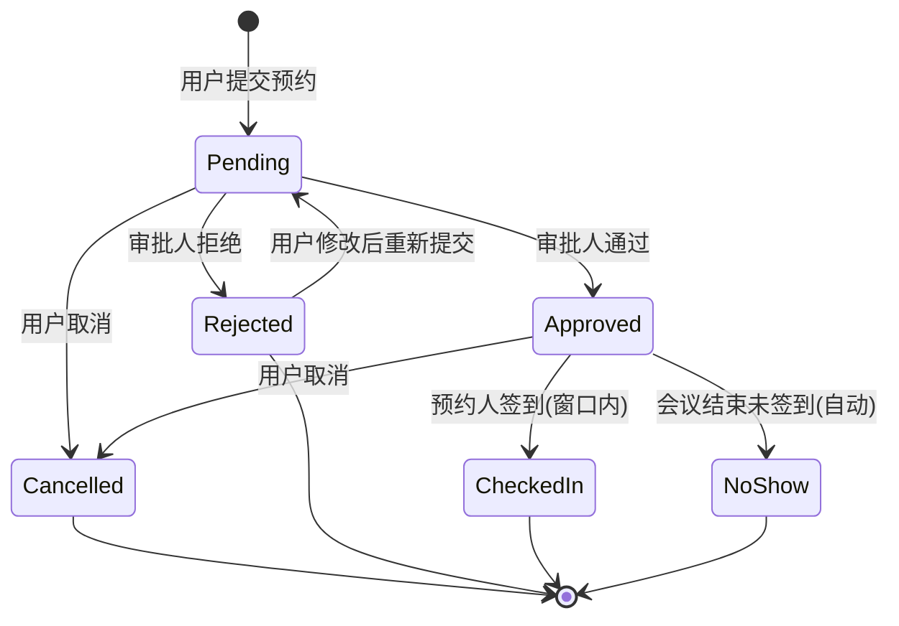

# plan.md — 企业级会议室预约系统 技术实施方案

> **状态：** 待评审  
> **基于：** spec.md v1.0 / constitution.md v3.2 / AGENTS.md v3.2  
> **日期：** 2026-06-12  
> **技术栈：** Java 17+ / Spring Boot 3.x / MyBatis / Vue 3 + TypeScript + Vite

---

## 1. 审查结论与架构决策

### 1.1 文档信息与上下文

- **系统定位：** 企业内部会议室预约管理系统，解决会议室资源争用、审批管控与使用统计问题
- **目标用户规模：** 50-500 人，10-50 间会议室（`spec` §8）
- **技术栈：** 后端 Java 17+ / Spring Boot 3.x / MyBatis；前端 Vue 3 / TypeScript / Vite / Pinia
- **无外部系统依赖：** 账号密码自建、站内信自建（`spec` §9）

### 1.2 Spec 审查结果

**已明确信息：**
- 12 个核心场景、18 条验收标准、7 条业务不变量，定义清晰
- 角色模型简单：普通用户 + 管理员（兼审批人），无复杂 RBAC
- 预约状态流转完整：待审批 → 已通过/已拒绝；修改 → 待审批；取消 → 已取消；已通过 → 已签到/未到场
- 冲突检测规则明确：待审批预约也占用时间段（INV-01）
- 签到与未到场惩罚规则明确（SCN-11, SCN-12）

**缺失但影响较小的信息（以假设补全）：**
- `假设：ASM-P01` 密码存储使用 BCrypt 哈希，满足基本安全要求
- `假设：ASM-P02` 未到场自动判定采用定时任务轮询（每分钟扫描已结束但未签到的预约），而非事件驱动
- `假设：ASM-P03` 管理员手动清零未到场次数通过用户管理界面操作
- `假设：ASM-P04` 统计数据基于已通过的预约聚合查询，不引入独立统计表
- `假设：ASM-P05` 站内信为简单消息模型，仅支持未读/已读状态，不支持回复

**缺失且可能影响架构的信息（需关注）：**
- 无分页/排序规范 → `假设：ASM-P06` 列表接口默认分页（每页 20 条），支持按创建时间倒序
- 无并发规模量化 → 按 spec §8 "中型规模" 设计，不引入分布式锁，使用数据库行级锁保证冲突检测一致性

**关键开放问题：**
- 无

### 1.3 合宪性（Constitution）承接

| 宪法原则 | 本方案承接方式 |
|----------|---------------|
| 真理原则 | 所有领域词汇严格映射 spec §2 术语表；代码命名使用英文对应术语 |
| 验证原则 | 每条 AC 映射到具体测试策略；核心逻辑强制表格驱动测试 |
| 极简原则 | 不引入 CQRS/领域事件/Outbox/微前端/复杂缓存；轻量 DDD 分层 |
| 演进原则 | 分 3 个 Milestone 端到端交付，每个 Milestone 可独立运行验证 |
| 失败显式原则 | 业务规则冲突返回显式 Result；系统故障抛异常；前端统一错误反馈 |

### 1.4 核心架构决策

| # | 决策 | 取舍理由 | 来源 |
|---|------|----------|------|
| D1 | **轻量 DDD 分层**：Domain / Application / Infrastructure / Interfaces(Web) 四层，但不引入聚合根仓库的完整 DDD 基础设施 | 项目规模中等，核心复杂度集中在冲突检测与状态流转，轻量分层足以保证业务规则内聚与可测试性 | constitution §4, spec 规模 |
| D2 | **乐观锁 + 数据库唯一约束** 保证冲突检测的并发安全，不引入分布式锁 | 中型规模下数据库行级锁足够；唯一约束（room_id + 日期范围）作为最后防线 | spec §8, 假设 ASM-P06 |
| D3 | **定时任务轮询** 实现未到场自动判定，不使用消息队列 | 无外部依赖约束（spec §9），定时任务简单可靠，满足业务时效性要求（分钟级延迟可接受） | spec §9, 假设 ASM-P02 |
| D4 | **Session-Based 认证**，不引入 JWT / OAuth | 无 SSO 集成需求（spec §4 Out of Scope），Session 方案简单安全 | spec §4, §9 |
| D5 | **前端统一 API Client + 全局拦截器** 处理鉴权/加载/错误态 | 避免每个组件重复处理；与后端契约通过代码审查保证一致性 | constitution §6, AGENTS §4 |

---

## 2. 领域建模与核心抽象

### 2.1 核心领域概念

| 概念 | 类型 | 说明 |
|------|------|------|
| MeetingRoom | 实体 | 会议室，含名称/位置/容量/设备/状态(启用/停用) |
| Reservation | **聚合根** | 预约，核心实体，含会议室引用/时间段/状态/会议名称/参会人数/预约人 |
| User | 实体 | 用户，含用户名/密码/角色/部门引用/未到场次数 |
| Department | 实体 | 部门，含名称/审批人引用 |
| Notification | 实体 | 站内信，含接收人/内容/已读状态/关联预约 |
| TimeSlot | 值对象 | 时间段（startTime, endTime），用于冲突检测 |
| Equipment | 值对象 | 设备枚举（PROJECTOR, WHITEBOARD, VIDEO_CONF 等） |
| ReservationStatus | 值对象 | 预约状态枚举 |
| RoomStatus | 值对象 | 会议室状态枚举（ENABLED, DISABLED） |
| UserRole | 值对象 | 用户角色枚举（REGULAR, ADMIN） |
| ReservationBan | 值对象 | 预约禁令（禁令截止时间），嵌入 User 实体 |

### 2.2 状态流转与不变量

**预约状态机：**



**核心业务不变量守护位置：**

| 不变量 | 守护位置 | 机制 |
|--------|----------|------|
| INV-01 同室同时段无冲突 | Reservation 领域服务 | 冲突检测方法 + 数据库唯一约束兜底 |
| INV-02 预约需审批 | Reservation 状态机 | 状态流转只允许 Pending→Approved |
| INV-03 修改需重新审批 | Application 层编排 | 修改操作强制重置状态为 Pending |
| INV-04 停用室不可预约 | Reservation 领域服务 | 提交前校验会议室状态 |
| INV-05 时间约束 | Reservation 值对象 | TimeSlot 自校验 |
| INV-06 未到场自动判定 | 定时任务 | 扫描已结束未签到预约 |
| INV-07 禁令期间不可预约 | Reservation 领域服务 | 提交前校验用户禁令状态 |

### 2.3 系统结构建议

**后端分层：**

```
com.company.meeting
├── domain/                    # 领域层（纯 Java，无框架依赖）
│   ├── model/
│   │   ├── Reservation.java   # 聚合根
│   │   ├── MeetingRoom.java
│   │   ├── User.java
│   │   ├── Department.java
│   │   ├── Notification.java
│   │   └── ReservationBan.java
│   ├── types/                 # 值对象 & 枚举
│   │   ├── TimeSlot.java
│   │   ├── ReservationStatus.java
│   │   ├── RoomStatus.java
│   │   ├── UserRole.java
│   │   └── Equipment.java
│   ├── service/               # 领域服务（核心业务规则）
│   │   ├── ReservationDomainService.java  # 冲突检测、预约提交校验
│   │   └── CheckInDomainService.java      # 签到窗口校验
│   └── gateway/               # 仓储/网关接口（依赖倒置）
│       ├── ReservationRepository.java
│       ├── MeetingRoomRepository.java
│       ├── UserRepository.java
│       ├── DepartmentRepository.java
│       └── NotificationRepository.java
├── application/               # 应用层（编排，事务边界）
│   ├── service/
│   │   ├── ReservationApplicationService.java
│   │   ├── MeetingRoomApplicationService.java
│   │   ├── UserApplicationService.java
│   │   ├── NotificationApplicationService.java
│   │   └── StatisticsApplicationService.java
│   ├── dto/                   # 应用层 DTO
│   └── scheduler/             # 定时任务
│       └── NoShowDetectionScheduler.java
├── infrastructure/            # 基础设施层
│   ├── persistence/           # MyBatis 实现
│   │   ├── mapper/
│   │   ├── entity/            # 数据库映射实体（PO）
│   │   └── repository/        # Gateway 接口实现
│   ├── config/
│   └── security/              # Spring Security 配置
└── interfaces/                # 接口层
    └── web/
        ├── controller/
        ├── assembler/         # DTO ↔ 领域模型转换（MapStruct）
        └── dto/               # Request/Response DTO
```

**依赖规则（禁止反向依赖）：**
- `domain` → 无外部依赖（纯 Java）
- `application` → `domain`
- `infrastructure` → `domain`（实现 gateway 接口）
- `interfaces` → `application`

**前端划分：**

```
src/
├── views/                     # 页面组件
│   ├── auth/                  # 登录/注册
│   ├── reservation/           # 预约相关页面
│   ├── room/                  # 会议室管理页面
│   ├── user/                  # 用户管理页面
│   ├── notification/          # 站内信页面
│   └── statistics/            # 统计页面
├── components/                # 通用组件
├── composables/               # 组合式函数
├── stores/                    # Pinia Store
│   ├── auth.ts
│   ├── reservation.ts
│   ├── room.ts
│   ├── user.ts
│   ├── notification.ts
│   └── statistics.ts
├── services/                  # API 调用封装
│   └── api.ts                 # 统一 API Client
├── models/                    # 前端类型定义（与后端 DTO 对齐）
├── router/
└── utils/
```

### 2.4 关键抽象

| 抽象 | 位置 | 职责 |
|------|------|------|
| `ReservationRepository` | domain.gateway | 预约持久化与查询（含冲突检测查询） |
| `MeetingRoomRepository` | domain.gateway | 会议室持久化与查询 |
| `UserRepository` | domain.gateway | 用户持久化与查询 |
| `ReservationDomainService` | domain.service | 冲突检测、预约提交/修改的业务规则校验 |
| `CheckInDomainService` | domain.service | 签到窗口校验 |
| `SecurityContext` | infrastructure | 当前登录用户信息获取 |

---

## 3. 前后端边界与 API 契约

### 3.1 页面与前端架构

**页面模块划分：**

| 模块 | 页面 | 路由 | 权限 |
|------|------|------|------|
| 认证 | 登录页 | `/login` | 公开 |
| 认证 | 注册页 | `/register` | 公开 |
| 预约 | 会议室列表（含筛选） | `/rooms` | 已登录 |
| 预约 | 预约提交页 | `/reservations/new` | 普通用户 |
| 预约 | 我的预约列表 | `/reservations/mine` | 普通用户 |
| 预约 | 预约详情/修改 | `/reservations/:id` | 普通用户 |
| 审批 | 待审批列表 | `/approvals` | 管理员 |
| 会议室 | 会议室管理 | `/admin/rooms` | 管理员 |
| 用户 | 用户管理 | `/admin/users` | 管理员 |
| 通知 | 站内信列表 | `/notifications` | 已登录 |
| 统计 | 使用统计 | `/admin/statistics` | 管理员 |

**Store 职责：**
- `auth`：登录态、当前用户信息、登录/登出操作
- `reservation`：预约列表、预约详情、提交/修改/取消/签到操作
- `room`：会议室列表、筛选条件、停用/启用操作
- `user`：用户列表（管理员）、编辑操作
- `notification`：通知列表、未读数、标记已读
- `statistics`：统计数据、筛选条件

**加载/异常态策略：**
- 统一 loading 状态：Store 内 `loading: boolean`，组件通过 `v-loading` 指令或 `<Loading>` 组件展示
- 统一错误反馈：API Client 全局拦截器捕获 4xx/5xx，Toast 展示错误消息
- 空态：列表组件统一 `<Empty>` 占位
- 鉴权态：路由守卫检查登录状态，未登录重定向至 `/login`

### 3.2 API 设计与前后端契约

**状态码策略：**
- `200`：成功
- `201`：创建成功
- `400`：业务规则冲突（含具体业务错误码）
- `401`：未认证
- `403`：无权限
- `404`：资源不存在
- `500`：系统故障

**异常响应规范：**
```json
{
  "code": "RESERVATION_CONFLICT",
  "message": "会议室A在10:00-11:00已有预约，存在时间冲突",
  "timestamp": "2026-06-12T10:00:00"
}
```

**核心 API 路由骨架：**

| 接口路径 (URL) | Method | 功能描述 | 核心 Request | 核心 Response | 异常状态码 |
|---------------|--------|----------|-------------|--------------|-----------|
| `/api/auth/register` | POST | 用户注册 | `{username, password, departmentId}` | `{id, username, role}` | 400(用户名重复) |
| `/api/auth/login` | POST | 用户登录 | `{username, password}` | `{sessionId, user}` | 401(凭证错误) |
| `/api/auth/logout` | POST | 用户登出 | - | - | - |
| `/api/rooms` | GET | 会议室列表(含筛选) | `?capacityMin=&equipment=&status=&page=&size=` | `{content[], totalElements, totalPages}` | - |
| `/api/rooms` | POST | 新增会议室 | `{name, location, capacity, equipmentList}` | `{id, name, ...}` | 400(名称重复) |
| `/api/rooms/{id}` | PUT | 修改会议室 | `{name, location, capacity, equipmentList}` | `{id, name, ...}` | 404(不存在) |
| `/api/rooms/{id}` | DELETE | 删除会议室 | - | - | 400(存在关联预约), 404 |
| `/api/rooms/{id}/disable` | POST | 停用会议室 | - | `{id, status}` | 404 |
| `/api/rooms/{id}/enable` | POST | 启用会议室 | - | `{id, status}` | 404 |
| `/api/rooms/{id}/availability` | GET | 查询会议室可用时间段 | `?date=` | `{availableSlots[]}` | - |
| `/api/reservations` | POST | 提交预约 | `{roomId, startTime, endTime, meetingName, attendeeCount}` | `{id, status, ...}` | 400(冲突/时间约束/禁令), 404(会议室不存在) |
| `/api/reservations/mine` | GET | 我的预约列表 | `?status=&page=&size=` | `{content[], totalElements}` | - |
| `/api/reservations/{id}` | GET | 预约详情 | - | `{id, room, timeSlot, status, ...}` | 404 |
| `/api/reservations/{id}` | PUT | 修改预约 | `{roomId, startTime, endTime, meetingName, attendeeCount}` | `{id, status, ...}` | 400(冲突/时间约束), 403(非本人), 404 |
| `/api/reservations/{id}/cancel` | POST | 取消预约 | - | `{id, status}` | 400(已取消), 403, 404 |
| `/api/reservations/{id}/checkin` | POST | 签到 | - | `{id, status}` | 400(不在窗口/已签到), 403, 404 |
| `/api/approvals` | GET | 待审批列表 | `?page=&size=` | `{content[], totalElements}` | - |
| `/api/approvals/{id}/approve` | POST | 通过审批 | - | `{id, status}` | 404, 403(非审批人) |
| `/api/approvals/{id}/reject` | POST | 拒绝审批 | `{reason?}` | `{id, status}` | 404, 403 |
| `/api/users` | GET | 用户列表 | `?page=&size=` | `{content[], totalElements}` | 403 |
| `/api/users/{id}` | PUT | 编辑用户 | `{role, departmentId}` | `{id, ...}` | 403, 404 |
| `/api/users/{id}/reset-no-show` | POST | 清零未到场次数 | - | `{id, noShowCount}` | 403, 404 |
| `/api/notifications` | GET | 站内信列表 | `?unreadOnly=&page=&size=` | `{content[], totalElements}` | - |
| `/api/notifications/{id}/read` | POST | 标记已读 | - | `{id, read}` | 404 |
| `/api/notifications/unread-count` | GET | 未读通知数 | - | `{count}` | - |
| `/api/statistics/usage` | GET | 使用统计 | `?startDate=&endDate=&roomId=&groupBy=` | `{groups[]}` | 403 |

### 3.3 前后端联动验证约束

| 约束目标 | 约束内容 | 验证/落地方式建议 |
|----------|----------|-------------------|
| **环境与配置** | 前端 API Client 的 baseURL 必须与后端服务/代理配置一致 | Vite 代理配置 `vite.config.ts` + `.env` 文件；启动时检查连通性 |
| **类型契约** | 前端 TypeScript 类型定义必须与后端 DTO 保持完全一致 | 代码审查时逐字段比对；`models/` 目录结构与后端 `dto/` 一一对应 |
| **异常拦截** | 前端 Store/Service 必须统一拦截 API 错误，不得向 UI 层抛出未处理异常 | Axios 拦截器统一处理 4xx/5xx，Store catch 中转换业务错误消息 |
| **错误反馈** | API 返回 4xx/5xx 或业务异常时，前端必须有明确的用户级错误提示 | 全局 Toast（ElMessage）展示 `response.data.message` |
| **契约同步** | 后端 API 路由或参数变更时，必须强制同步更新前端 Service | 规范协同流程与代码评审检查；Service 层 URL 常量化 |

### 3.4 模型映射

- **HTTP Request → Application DTO**：Controller 层接收 `@RequestBody` Request DTO
- **Application DTO → Domain Model**：Application Service 内使用 Assembler（MapStruct）转换
- **Domain Model → Application DTO**：Application Service 内使用 Assembler 转换为 Response DTO
- **Response DTO → Page Model**：前端 Service 层返回原始 DTO，Store/Composable 负责转换为页面展示模型

---

## 4. 非功能性设计

### 4.1 防御性策略 (Fail-Fast)

| 场景类别 | 处理方式 | 示例 |
|----------|----------|------|
| 业务规则冲突（可预期） | 返回显式业务 Result，HTTP 400 + 业务错误码 | 预约冲突 → `RESERVATION_CONFLICT`；时间约束违规 → `TIME_CONSTRAINT_VIOLATION`；禁令期间 → `RESERVATION_BANNED` |
| 系统级故障（不可预期） | 抛出异常，全局异常处理器返回 500 | 数据库连接失败、空指针等 |
| 前端反馈 | 全局 HTTP 拦截器捕获错误，Toast 展示 `message` 字段 | 冲突提示："会议室A在10:00-11:00已有预约" |

**Result vs Exception 边界：**
- 领域服务返回 `Result<T>`（含业务错误码和消息），不抛异常
- Application 层根据 `Result.isFailure()` 决定抛 `BusinessException`（映射为 400）
- 基础设施故障直接抛异常，由 `@ControllerAdvice` 统一处理为 500

### 4.2 配置与环境

| 配置项 | 说明 |
|--------|------|
| 数据库 | MySQL 8.x（`假设：ASM-P07`），连接池 HikariCP |
| 多环境 | `application.yml` + `application-dev.yml` / `application-prod.yml` + 环境变量覆盖 |
| 启动校验 | Spring Boot 启动时检查数据库连接、必要配置项是否存在 |
| 前端环境 | `.env.development` / `.env.production`，Vite 代理开发环境 API |

### 4.3 可观测性

| 维度 | 策略 |
|------|------|
| 日志 | SLF4J + Logback；关键操作（预约提交/审批/签到/禁令触发）记录 INFO 日志，含预约ID/用户ID |
| 请求追踪 | 请求头 `X-Request-Id`（Filter 生成 UUID），日志 MDC 注入 |
| 健康检查 | Spring Boot Actuator `/actuator/health` |

---

## 5. 测试驱动与验收契约 (Test-First)

### 5.1 各层测试目标

| 层 | 测试目标 | 工具 | 覆盖重点 |
|----|----------|------|----------|
| Domain | 领域规则正确性（冲突检测、时间约束、状态流转、签到窗口、禁令判定） | JUnit 5 + AssertJ | 核心业务不变量 |
| Application | 编排逻辑、事务边界、DTO 转换 | JUnit 5 + Mockito | 领域服务调用正确性 |
| API 集成 | HTTP 契约、鉴权、状态码、异常响应 | Spring MockMvc + `@WebMvcTest` | AC 验收标准 |
| 前端组件 | 页面交互、Store 状态变更 | Vitest + Vue Test Utils | 关键用户操作流程 |

### 5.2 表格驱动测试设计

**核心逻辑 1：冲突检测（INV-01）**

| # | 已有预约时间段 | 新预约时间段 | 是否冲突 | 说明 |
|---|---------------|-------------|----------|------|
| 1 | 10:00-11:00 | 11:00-12:00 | 否 | 端点相邻不冲突 |
| 2 | 10:00-11:00 | 09:00-10:00 | 否 | 端点相邻不冲突 |
| 3 | 10:00-11:00 | 10:30-11:30 | 是 | 部分重叠 |
| 4 | 10:00-11:00 | 09:30-10:30 | 是 | 部分重叠 |
| 5 | 10:00-11:00 | 09:00-12:00 | 是 | 完全包含 |
| 6 | 10:00-11:00 | 10:00-11:00 | 是 | 完全相同 |
| 7 | 10:00-11:00 | 08:00-09:00 | 否 | 完全不重叠 |
| 8 | 无 | 10:00-11:00 | 否 | 无已有预约 |

**核心逻辑 2：时间约束校验（INV-05）**

| # | 当前时间 | 预约开始时间 | 预约时长 | 是否合法 | 违规原因 |
|---|----------|-------------|----------|----------|----------|
| 1 | 09:00 | 10:00 | 1h | 合法 | 提前1h，时长≤2h |
| 2 | 09:00 | 09:30 | 1h | 非法 | 提前量<1h |
| 3 | 09:00 | 10:00 | 3h | 非法 | 时长>2h |
| 4 | 09:00 | 第15天10:00 | 1h | 非法 | 超出14天范围 |
| 5 | 09:00 | 第14天08:00 | 1h | 合法 | 在14天范围内 |

**核心逻辑 3：签到窗口校验（SCN-11）**

| # | 当前时间 | 会议开始时间 | 会议结束时间 | 可签到 | 说明 |
|---|----------|-------------|-------------|--------|------|
| 1 | 09:50 | 10:00 | 11:00 | 是 | 开始前10分钟 |
| 2 | 10:10 | 10:00 | 11:00 | 是 | 开始后10分钟 |
| 3 | 09:40 | 10:00 | 11:00 | 否 | 开始前>15分钟 |
| 4 | 10:20 | 10:00 | 11:00 | 否 | 开始后>15分钟 |
| 5 | 10:00 | 10:00 | 11:00 | 是 | 恰好开始 |

**核心逻辑 4：未到场禁令判定（SCN-12）**

| # | 累计未到场次数 | 本次判定后次数 | 是否触发禁令 | 禁令天数 |
|---|--------------|--------------|-------------|----------|
| 1 | 2 | 3 | 是 | 7天 |
| 2 | 4 | 5 | 是 | 30天 |
| 3 | 1 | 2 | 否 | - |
| 4 | 3(已在禁令中) | 4 | 否(已在禁令中) | - |

### 5.3 验收场景映射

| AC | 测试层 | 测试策略 | 通过条件 |
|----|--------|----------|----------|
| AC-01 | API 集成 | 提交无冲突预约 → 201 + status=PENDING + 通知已创建 | 状态正确、时间段占用、审批人收到通知 |
| AC-02 | Domain + API | 提交冲突预约 → 400 + RESERVATION_CONFLICT | 冲突被检测并拒绝 |
| AC-03 | API 集成 | 审批通过 → 200 + status=APPROVED + 通知已创建 | 状态正确、用户收到通知 |
| AC-04 | API 集成 | 审批拒绝 → 200 + status=REJECTED + 时间段释放 | 状态正确、时间段释放、用户收到通知 |
| AC-05 | API 集成 | 取消预约 → 200 + status=CANCELLED + 时间段释放 | 状态正确、审批人收到通知 |
| AC-06 | API 集成 | 修改预约无冲突 → 200 + status=PENDING + 新时间段占用 | 原时间段释放、新时间段占用、需重新审批 |
| AC-07 | Domain + API | 修改预约有冲突 → 400 + RESERVATION_CONFLICT | 冲突被检测并拒绝 |
| AC-08 | API 集成 | 被拒绝预约修改重提 → 200 + status=PENDING | 状态正确、走审批流程 |
| AC-09 | Domain + API | 时间约束违规 → 400 + TIME_CONSTRAINT_VIOLATION | 具体约束违规信息返回 |
| AC-10 | Domain + API | 预约停用会议室 → 400 + ROOM_DISABLED | 会议室状态校验生效 |
| AC-11 | API 集成 | 停用会议室 → 关联预约全部 CANCELLED + 通知已创建 | 所有未来预约取消、用户收到通知 |
| AC-12 | API 集成 | 未登录访问 → 401 | 鉴权拦截生效 |
| AC-13 | API 集成 | 启用会议室 → status=ENABLED | 会议室恢复可预约 |
| AC-14 | Domain + API | 签到窗口内签到 → 200 + status=CHECKED_IN | 签到成功 |
| AC-15 | Domain + API | 签到窗口外签到 → 400 + CHECK_IN_NOT_AVAILABLE | 签到被拒绝 |
| AC-16 | 定时任务 | 会议结束未签到 → status=NO_SHOW + 次数+1 | 自动判定生效 |
| AC-17 | Domain | 累计3次未到场 → 禁令7天 + 通知 | 禁令触发正确 |
| AC-18 | Domain + API | 禁令期间预约 → 400 + RESERVATION_BANNED | 禁令校验生效 |

### 5.4 追踪关系

```
Spec (AC-01~18) → Plan (§5.3 验收映射) → Tests (表格驱动 + API 集成) → Code (Domain/Application/Web)
```

- 每个 AC 在测试类中以 `should_期望行为_when_条件` 命名
- Domain 测试覆盖核心不变量，API 测试覆盖端到端 AC
- CI 中测试失败即视为 AC 未通过

---

## 6. 实施路径与风险限制

### 6.1 分阶段建议（Milestones）

| Milestone | 内容 | 端到端可验证标准 |
|-----------|------|-----------------|
| **M1：基础领域模型与基础设施** | Domain 层核心模型（Reservation/MeetingRoom/User/Department/Notification）、值对象、领域服务（冲突检测/时间约束/签到窗口/禁令判定）、Gateway 接口、Infrastructure 层（MyBatis + MySQL 建表）、Repository 实现 | Domain 单元测试全部通过（表格驱动测试覆盖 §5.2 全部场景）；数据库可启动、表可创建 |
| **M2：核心 API 与后端逻辑** | Application Service、Controller、DTO/Assembler、认证（Session）、审批流程、停用/启用、签到、定时任务（未到场判定）、站内信 | API 集成测试覆盖 AC-01~AC-18；Postman/curl 可调通全部核心接口 |
| **M3：前端集成与端到端验证** | Vue 3 项目搭建、路由/Store/Service、全部页面、API 对接、鉴权/加载/错误态、端到端手动验证 | 全部页面可操作、核心流程（预约→审批→签到→未到场→禁令）端到端通过 |

### 6.2 技术限制与假设

| 限制/假设 | 影响 | 不成立时的应对 |
|-----------|------|---------------|
| ASM-P01 BCrypt 密码哈希 | 基本安全 | 若需更强安全，可升级为 Argon2 |
| ASM-P02 定时任务轮询（1分钟间隔） | 未到场判定有最多1分钟延迟 | 若需实时性，可改为事件驱动（需引入消息队列） |
| ASM-P03 管理员手动清零未到场次数 | 需用户管理界面支持 | 无重大影响 |
| ASM-P04 统计基于聚合查询 | 大数据量时查询可能变慢 | 若性能不足，可引入物化视图或统计表 |
| ASM-P05 站内信简单模型 | 不支持回复/分类 | 若需扩展，需重新设计通知模型 |
| ASM-P06 默认分页 20 条 | 无重大影响 | 可配置化 |
| ASM-P07 MySQL 8.x | SQL 语法与索引策略 | 若换数据库，需调整 MyBatis 映射 |

**明确不引入的复杂设计：**
- CQRS / Event Sourcing / Outbox Pattern
- 分布式锁 / 分布式事务
- 消息队列（Kafka/RabbitMQ）
- 微前端 / BFF
- 复杂缓存体系（Redis 等）
- JWT / OAuth / SSO

### 6.3 并发控制策略

| 场景 | 策略 | 说明 |
|------|------|------|
| 预约提交（冲突检测） | 乐观锁 + 数据库排他查询 | `SELECT ... FOR UPDATE` 锁定同一会议室当日预约行，检测无冲突后插入 |
| 审批操作 | 乐观锁（版本号） | 防止并发审批同一预约 |
| 停用会议室 | 乐观锁 + 批量取消事务内完成 | 停用与取消预约在同一事务内 |

### 6.4 事务边界

| 操作 | 事务边界 | 说明 |
|------|----------|------|
| 提交预约 | `ReservationApplicationService.createReservation` | 冲突检测 + 插入预约 + 创建通知，同一事务 |
| 修改预约 | `ReservationApplicationService.updateReservation` | 释放原时间段 + 冲突检测 + 占用新时间段 + 创建通知，同一事务 |
| 取消预约 | `ReservationApplicationService.cancelReservation` | 更新状态 + 释放时间段 + 创建通知，同一事务 |
| 审批通过/拒绝 | `ReservationApplicationService.approve/reject` | 更新状态 + (拒绝时)释放时间段 + 创建通知，同一事务 |
| 停用会议室 | `MeetingRoomApplicationService.disableRoom` | 更新会议室状态 + 批量取消关联预约 + 批量创建通知，同一事务 |
| 签到 | `ReservationApplicationService.checkIn` | 更新预约状态，单事务 |
| 未到场判定 | `NoShowDetectionScheduler.detectNoShow` | 单条预约判定 + 更新状态 + 更新用户次数 + 检查禁令 + 创建通知，单条事务（逐条处理，避免长事务） |

---

## 附录：设计模式采用说明

| 模式 | 位置 | 解决的问题 | 为什么适合 | 为什么不采用更复杂方案 |
|------|------|-----------|-----------|----------------------|
| 依赖倒置（Gateway 接口） | domain.gateway | Domain 层不依赖数据库 | 保证 Domain 可独立测试 | 项目简单，无需完整 Repository 抽象 |
| Result 模式 | 领域服务返回值 | 区分业务规则冲突与系统故障 | 可预期的失败用 Result，不可预期的用 Exception | 无需 Either/Monad 等函数式抽象 |
| Assembler（MapStruct） | Application 层 | DTO ↔ 领域模型转换 | 编译期生成，类型安全，无反射开销 | 无需手动映射或反射工具 |
| 策略模式（隐式） | 未到场禁令判定 | 阶梯式惩罚规则 | 简单 if-else 即可表达，规则仅2级 | 规则固定且少，无需规则引擎 |
